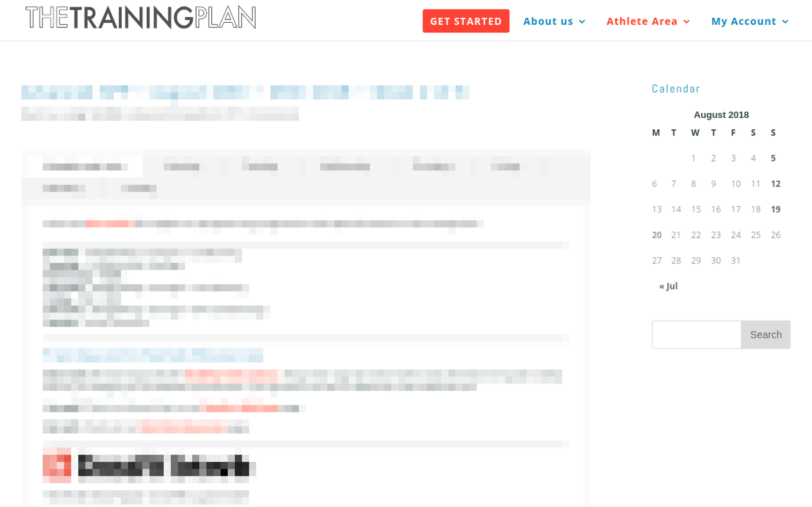

# Chrome extension for thetrainingplan.co

Convert thetrainingplan.co usual tabbed page layout into a flat style web page, that is friendly to be saved as PDF

The extension installs an icon in Chrome menu. The icon is active only if current open page is a member page on thetrainingplan.co

This module WILL NOT help you reach any of the member pages. You have to be logged in and navigate to the page by yourself.

Once you are on compatible page, the icon will become active.

Then you can click on it

Clicking on Make Flat button, will transform the original page:

into a flat design page

which is far more convenient to print to PDF.

If printed as PDF, the resulting file keeps its internal navigation links, which makes it easy to browse the program by day
